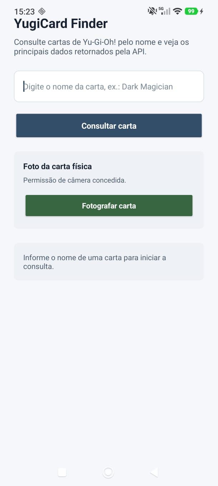
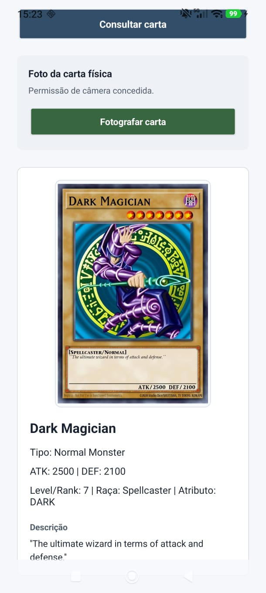

# YugiCard Finder

## Descrição
Aplicativo Android nativo em Kotlin para consultar cartas de Yu-Gi-Oh! pelo nome. O usuário informa uma carta, toca em consultar e visualiza dados úteis retornados pela API pública.

## API utilizada
- Nome da API: YGOPRODeck API
- Endpoint utilizado: `https://db.ygoprodeck.com/api/v7/cardinfo.php?fname={nome_da_carta}`
- Exemplo de URL consultada: `https://db.ygoprodeck.com/api/v7/cardinfo.php?fname=Dark%20Magician`
- Principais dados retornados: imagem da carta, nome, tipo, descrição, ATK, DEF, level/rank, raça e atributo.

## Funcionalidades
- Entrada de dados pelo usuário
- Validação de campo vazio
- Consulta a uma API pública
- Exibição dos dados retornados
- Tratamento básico de erro
- Solicitação da permissão de câmera para fotografar uma carta física

## Tecnologias utilizadas
- Kotlin
- Android Studio
- XML
- `HttpURLConnection` para requisição HTTP
- API pública YGOPRODeck

## Permissões utilizadas
O aplicativo utiliza a permissão INTERNET para realizar requisições à API pública.
Também utiliza a permissão CAMERA para permitir que o usuário fotografe uma carta física como referência visual.

```xml
<uses-permission android:name="android.permission.INTERNET" />
<uses-permission android:name="android.permission.CAMERA" />
```

## Como executar o projeto
1. Clonar este repositório.
2. Abrir o projeto no Android Studio.
3. Aguardar a sincronização do Gradle.
4. Executar o app em um emulador ou dispositivo físico.
5. Informar o nome de uma carta, como `Dark Magician`, `Blue-Eyes` ou `Kuriboh`, e realizar a consulta.

## Prints do aplicativo

### Tela inicial


### Solicitação da permissão de câmera


### Resultado da consulta


## Autores
1. João Pedro de Paula Gomes
2. Kaio Dias Gomes de Oliveira 
3. Enzo Lanes Viana
